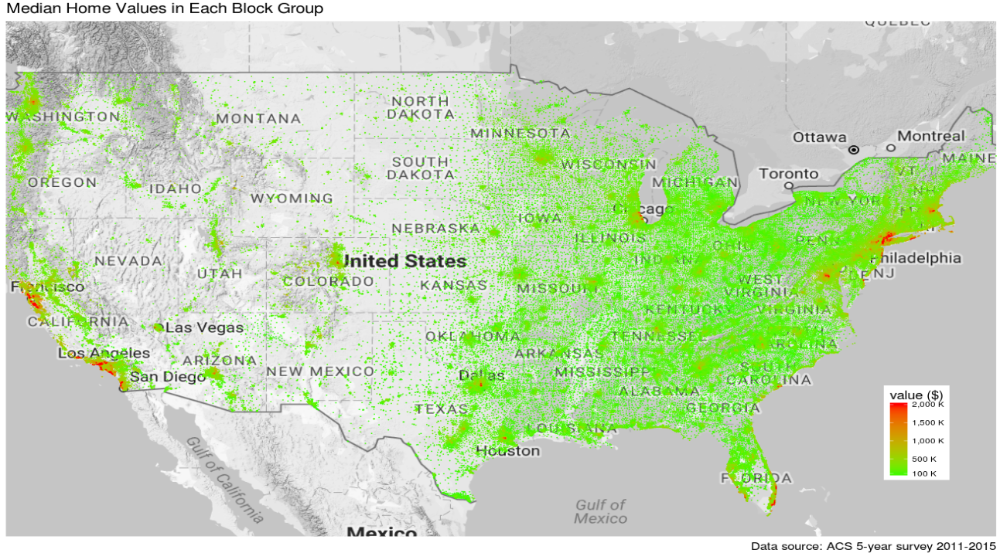
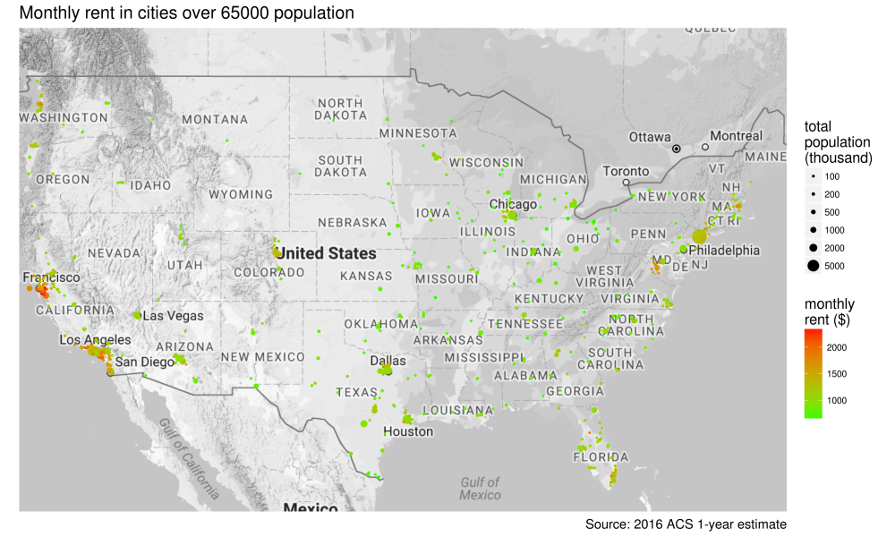
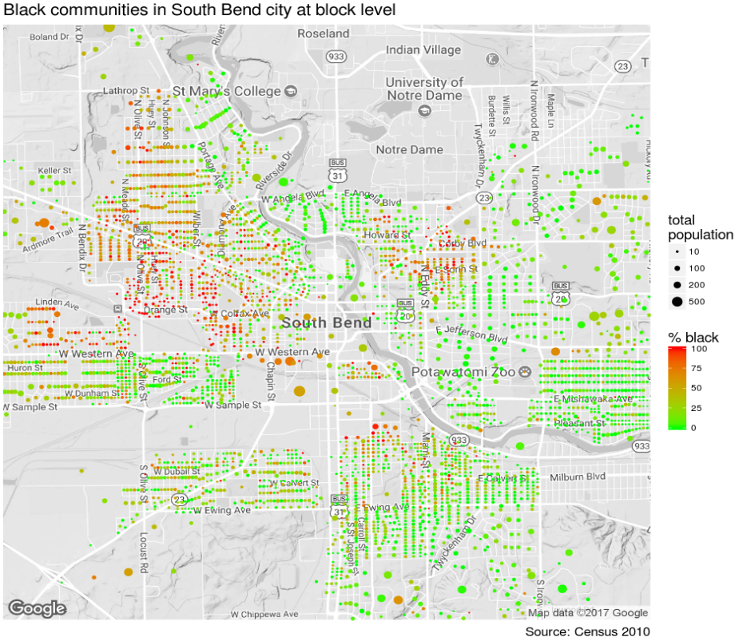

<!-- README.md is generated from README.Rmd. Please edit that file -->
[](https://travis-ci.org/GL-Li/totalcensus)   

Extract Decennial Census and American Community Survey Data
===========================================================

Download summary files from [Census Bureau](https://www2.census.gov/) and extract data of decennial censuses and American Community Surveys from your local computer.

Update
------

**2/7/2019**: Version 0.6.1 is on CRAN.

-   Added GEOID to decennial census for selected summary levels so that it will be easier to compare the same geographic areas in decennial census and American Community Survey.
-   `read_acs1year()` and `read_acs5year()` run faster in the new version.

**12/7/2018**: Package `totalcensus` v0.5.1 is on CRAN. It includes

-   Decennial census 2000 and 2010
-   ACS 1 year: 2005 - 2017
-   ACS 5 year: 2009 - 2017

Installation and setup
----------------------

### Installation

``` r
# from CRAN
install.packages("totalcensus")

# development version
devtools::install_github("GL-Li/totalcensus")
```

### Setup

This package requires downloading census data and you need to create a folder to store the downloaded data. Let's call the folder `my_census_data` and assume the full path to this folder is `xxxxx/my_census_data`. Run the function below to set the path for the package.

``` r
library(totalcensus)
set_path_to_census("xxxxx/my_census_data")
```

Why another R census package
----------------------------

The [census API](https://www.census.gov/data/developers/guidance/api-user-guide.Available_Data.html) offers most data in decennial censuses and ACS estimates for download and API-based packages such as `tidycensus`, `censusapi` and `acs` make the downloading very convenient in R. So why we need another package?

One advantage is that once you downloaded the summary files, you do not need internet anymore and everything is on your own computer. You do not need to worry about internet interruption or government shutdown. You have total control of the data.

Another benefit of using package `totalcensus` is that it makes census data extraction more flexible. It is particularly convenient to extract high resolution data at census tract, block group, and block level for a large area.

Here is an example of how we extract the median home values in **all** block groups in the United States from 2011-2015 ACS 5-year survey with this package. You simply need to call the function `read_acs5year()`. It takes 15 seconds for my 4-years old laptop to return the data of all 217,739 block groups. In addition to the table contents we request, we also get the population and coordinate of each block group.

``` r
library(totalcensus)
home_national <- read_acs5year(
    year = 2015,
    states = states_DC,   # all 50 states plus DC
    table_contents = "home_value = B25077_001",
    summary_level = "block group"
)
```

With the coordinates, we can visualize the data on US map with `ggplot2` and `ggmap`. Each data point in the figure below corresponds to a a block group, colored by median home value and sized by population. This plot not only displays the median home values, but also tells population densities on the map.



There are additional benefits of using this package:

-   You can get detailed urban/rural data from Census 2010. This package use summary file 1 with urban/rural update, while the census API only provide data in summary file 1 before urban/rural update.
-   You can get all block groups that belong or partially belong to a city. Original census data do not provide city information for a block group as a block group may not uniquely belong to a city. However, large cities have most block groups within their boundaries and only a small number of block groups run across the borders. The block group level data provide valuable spatial information of a city. This is particularly helpful for ACS 5-year surveys which cover data down to the level of block groups.
-   It provides longitude and latitude of the internal point of a geographic area for easy and quick mapping. You do not always need shape files to make nice maps, as in the map shown above.

### More reading materials

-   [Extract US Census 2010 data with data.table and dplyr](https://gl-li.netlify.com/2017/08/29/process-2010-census-data-with-data-table/): this post explains how the summary files of decennial census 2010 are processed under the hood in `totalcensus` package.
-   [Proccess 5-digit ZIP Code Tabulation Area (ZCTA5) data with totalcensus package](https://gl-li.netlify.com/2017/12/23/census_data_zip_code/): an application example.
-   [Using totalcensus package to determine relationship between census geographic entities](https://gl-li.netlify.com/2017/12/28/use-totalcensus-package-to-determine-relationship-between-geographic-entities/); an application example.

Basic application
-----------------

### the `read_xxxx()` functions

The package has three functions to read decennial census, ACS 5-year survey, and ACS 1-year survey: `read_decennial()`, `read_acs5year()`, and `read_acs1year()`. They are similar but as these datasets are so different, we prefer to keep three separate functions, one for each.

The function arguments serve as filters to select the data you want:

-   year: the year or ending year of the decennial census or ACS estimate.
-   states: the states of which you want read geography and data files. In addition to 50 states and "DC", you can choose from "PR" (Puerto Rico), plus a special one "US" for national files.
-   table\_contents: this parameter specifies which table contents you want to read. Population is always returned even if table\_contents is NULL. Users can name the table contents in the format such as `c("male = B01001_002", "female = B01001_026")`.
-   areas: if you know which metropolitan areas, counties, cities and towns you want to get data from, you can specify them here by name or FIPS code, for example, `c("New York metro", "PLACE = UT62360", "Salt Lake City city, UT")`.
-   geo\_headers: In case you do not know which areas to extract data, you can read all the geographic headers specified here and select areas after reading.
-   summary\_level: it determines which summary level data to extract. Common ones like "state", "county", "place", "county subdivision", "tract", "block group", and "block" can be input as plain text. Others have to be given by code.
-   geo\_comp: specifies data of which geographic component you want. Most common ones are "total", "urban", "urbanized area", "urban cluster", and "rural". Others are provided by code.

Functions `read_acs1year()` and `read_acs5year()` have additional argument:

-   with\_margin: whether to read margin of error of the estimate.
-   dec\_fill: whether to fill geo\_headers codes with data from decennial census. The codes in ACS summary file are often incomplete. To use decennial census 2010 data to fill the missing values, set the argument to "dec2010".

### the `search_xxxx()` functions

There are a family of `search_xxx()` functions to help find table contents, geoheaders, summary levels, geocomponents, FIPS codes and CBSA codes.

The following examples demonstrate how to use these `read_xxx()` and `search_xxx()` functions.

### Median gross rent in cities with population over 65000

A property management company wants to know the most recent rents in major cities in the US. How to get the data?

We first need to determine which survey to read. For most recent survey data, we want to read 2016 ACS 1-year estimates, which provide data for geographic areas with population over 65000.

We also need to determine which data files to read. We know summary level of cities is "160" or "place". Browsing with `search_summarylevels("acs1")`, we see that this summary level is only in state files of ACS 1-year estimates. So we will read all the state files.

Then we need to check if 2016 ACS 1-year estimate has the rent data. We run `search_tablecontents("acs1")` to open the dataset with `View()` in RStudio. You can provide keywords to search in the function but it is better to do the search in RStudio with filters. There are so many tables that contains string "rent". It takes some time to find the right one if you are not familiar with ACS tables. After some struggle, we think B25064\_001 is what we want.

We do not need to specify `areas` and `geo_headers` as we are extracting all geographic areas matches the conditions.

Below is the code that gives what we want. The first time you use `read_xxxx()` functions to read data files, you will be asked to download data generated from decennial census 2010 and summary files required for this function call, in this case, 2016 ACS 1-year summary files. Choose 1 to continue.

``` r
rent <- read_acs1year(
    year = 2016,
    states = states_DC,
    table_contents = "rent = B25064_001",
    summary_level = "place"
) 

# Fisrt 5 rows
#              GEOID                           NAME STUSAB population rent GEOCOMP SUMLEV        lon      lat
#  1: 16000US0203000 Anchorage municipality, Alaska     AK     298192 1296   total    160 -149.27435 61.17755
#  2: 16000US0107000       Birmingham city, Alabama     AL     213434  777   total    160  -86.79905 33.52744
#  3: 16000US0121184           Dothan city, Alabama     AL      67714  720   total    160  -85.40682 31.23370
#  4: 16000US0135896           Hoover city, Alabama     AL      84943 1021   total    160  -86.80558 33.37695
#  5: 16000US0137000       Huntsville city, Alabama     AL     196225  766   total    160  -86.53900 34.78427
```

It is always nice to visualize them on US map.

``` r
library(ggplot2)
# ggmap requires 
library(ggmap)
# You need to use your own google clound API key
register_google("your_google_api_key")
us_map <- get_map("united states", zoom = 4, color = "bw")

ggmap(us_map) + 
    geom_point(
        data = rent[order(-population)],
        aes(lon, lat, size = population/1e3, color = rent)
    ) +
    ylim(25, 50) +
    scale_size_area(breaks = c(100, 200, 500, 1000, 2000, 5000)) +
    scale_color_continuous(low = "green", high = "red") +
    labs(
        color = "monthly\nrent ($)",
        size = "total\npopulation\n(thousand)",
        title = "Monthly rent in cities over 65000 population",
        caption = "Source: 2016 ACS 1-year estimate"
    ) +
    theme(
        panel.background = element_blank(),
        axis.title = element_blank(),
        axis.text = element_blank(),
        axis.ticks = element_blank(),
        title = element_text(size = 14)
    )
```



### Black communities in South Bend city, Indiana at census block level

Only the decennial census has data down to block level. The most recent one is Census 2010.

Knowing names of a city, county, metro area, or town, we can feed them directly to argument `areas`. The returned data.table contains the table contents we want as well as population and coordinates. The reading takes a few seconds.

``` r
# read data of black population in each block
black_popul <- read_decennial(
    year = 2010,
    states = "IN",
    table_contents = "black_popul = P0030003",
    areas = "South Bend city, IN",
    summary_level = "block"
)

# first 5 rows of black_popul:
   #                   area       lon      lat state population black_popul GEOCOMP SUMLEV
   # 1: South Bend city, IN -86.21864 41.63613    IN         28          10     all    100
   # 2: South Bend city, IN -86.21659 41.63670    IN          0           0     all    100
   # 3: South Bend city, IN -86.22172 41.63573    IN         52          16     all    100
   # 4: South Bend city, IN -86.22022 41.63182    IN        279          21     all    100
   # 5: South Bend city, IN -86.22093 41.63367    IN         42           1     all    100
```

It is better to separate data manipulation from reading to save reading time as you usually need to try multiple manipulations. Data manipulation can be done with `data.table` or `dplyr`.

``` r
library(magrittr)

# remove blocks where no people lives in and add a column of black percentage. 
black <- black_popul %>%
    .[population != 0] %>%
    # percentage of black population in each block
    .[, black_pct := round(100 * black_popul / population, 2)]
```

Again we visualize percentage of black population on map with `ggplot2` and `ggmap`.

``` r
south_bend <- get_map("south bend, IN", zoom = 13, color = "bw")
ggmap(south_bend) +
    geom_point(
        data = black,
        aes(lon, lat, size = population, color = black_pct)
    ) +
    scale_size_area(breaks = c(10, 100, 200, 500)) +
    scale_color_continuous(low = "green", high = "red") +
    labs(
        color = "% black",
        size = "total\npopulation",
        title = "Black communities in South Bend city at block level",
        caption = "Source: Census 2010"
    ) +
    theme(
        panel.background = element_blank(),
        axis.title = element_blank(),
        axis.text = element_blank(),
        axis.ticks = element_blank(),
        title = element_text(size = 14)
    )
```



Downloading data
----------------

This package requires downloading census data to your local computer. You will be asked to download data when you call `read_xxxx` functions. The downloaded data will be extracted automatically to the folder `my_census_data`.

A set of data generated from Census 2010 will also be downloaded, which is used to fill missing geographic header records in ACS data.

The census data can be found on Census Bureau's website but you do not need to download them manually. Use the function above.

-   [Census 2010 summary file 1 with urban/rural update](https://www2.census.gov/census_2010/04-Summary_File_1/Urban_Rural_Update/)
-   [ACS summary files since 2005](https://www2.census.gov/programs-surveys/acs/summary_file/)
